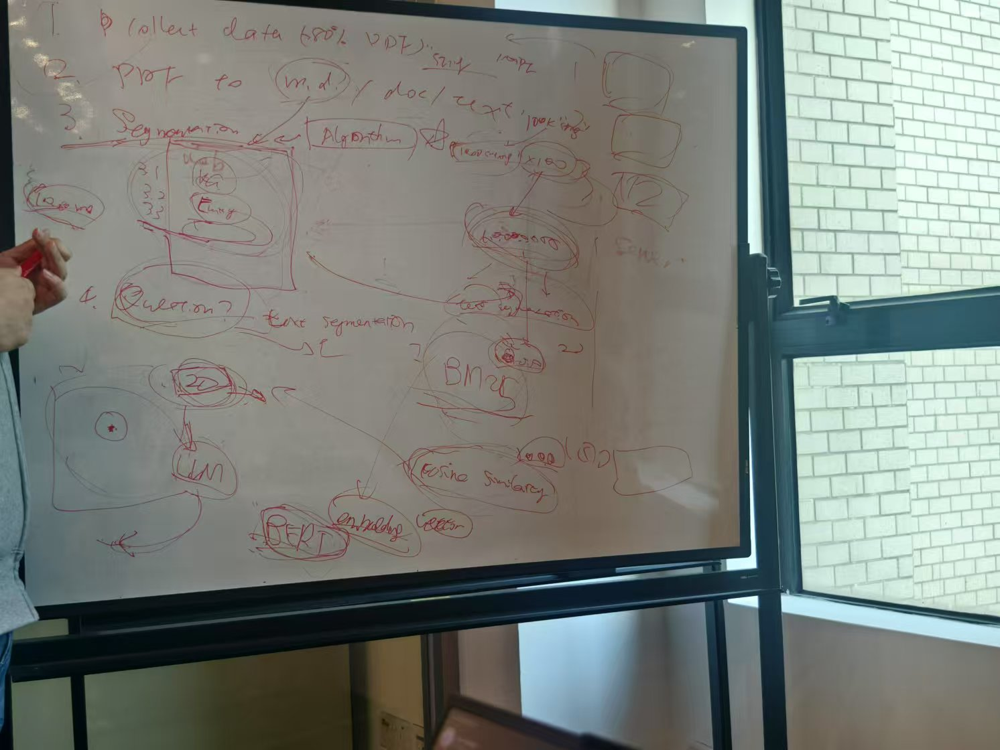

# RAGnition

LU Graduation Project RAGnition Team

# CDS536 Data Science Project

Group Name:            RAGnition

Director:              Prof. Nan LI Nancy

Project:        Developing a Policy QA System Using Retrieval-Augmented Generation (RAG) Framework

| Student No. | English Name | Email Address (Lingnan Email) |
|-------------|--------------|-------------------------------|
| 3160708     | LUO Suhai    | suhailuo@ln.hk                |
| 3160291     | WEI Fansen   | fansenwei@ln.hk               |
| 3160320     | LI Junrong   | junrongli@ln.hk               |
| 3160734     | WANG Jiawei  | jiaweiwang2@ln.hk             |
| 3160722     | Wang Zihao   | zihaowang3@ln.hk              |
| 3160069     | GUAN Yuqi    | yuqiguan@ln.hk                |

# RAGnition

Policies are often complex, lengthy, and filled with technical language, making it challenging for individuals to
extract the specific information they need efficiently. A policy QA System aims to bridge this gap by providing concise,
accurate, and user-friendly answers to policy-related queries. Traditional QA systems typically have pre-defined QA
pairs and then use information retrieval techniques to find QA pairs related to users’ questions. As LLM becomes
popular, a machine can generate answers without retrieving information. However, generation-based systems often face a
significant challenge –hallucinations, where the system generates incorrect or fabricated information that lacks
grounding in factual data, which is a critical problem for a policy QA system.

This project addresses the hallucination problem by developing a QA system based on the Retrieval-Augmented Generation (
RAG) framework. RAG combines the best of retrieval-based and generation-based approaches, aiming to significantly reduce
hallucinations in language model outputs by grounding answers in factual, retrieved data. The RAG framework operates
through two main components: the retrieved part and the generation part. The retrieval part retrieves relevant policy
documents or sections from policy documents on user queries. The generation part synthesizes an easy-to-understand
response based on the retrieved content. Unlike standalone generative models that may invent fake details when faced
with incomplete information, the RAG approach ensures that all answers are firmly rooted in the retrieved policy data.
This enhances the credibility and reliability of the system.An additional challenge in building such a system is
balancing speed and accuracy. While users often expect rapid responses, the system must also ensure that answers are
precise and factually grounded. Students will explore various techniques to optimize this trade-off, ensuring that the
QA system is both efficient and accurate for real-time policy inquiries.

# Reference

1. Lewis, P., Perez, E., Piktus, A., Petroni, F., Karpukhin, V., Goyal, N., ... & Kiela, D. (2020). Retrieval-augmented
   generation for knowledge-intensive nlp tasks. Advances in Neural Information Processing Systems, 33, 9459-9474.
2. Gao, Y., Xiong, Y., Gao, X., Jia, K., Pan, J., Bi, Y., ... & Wang, H. (2023). Retrieval-augmented generation for
   large language models: A survey. arXiv preprint arXiv:2312.10997.
3. Wu, J., Zhu, J., Qi, Y., Chen, J., Xu, M., Menolascina, F., & Grau, V. (2024). Medical Graph RAG: Towards safe
   medical large language model via graph retrieval-augmented generation. arXiv preprint arXiv:2408.04187.
4. https://www.cnblogs.com/tgltt/p/18512586

# RAGnition Talk Series

### RAGnition Talk 1

| Time   | 周二 2025-01-14 14:00 - 16:00          |
|--------|--------------------------------------|
| Period | 0101-0112                            |
| Output | Literacy Review in everyone's folder |

### RAGnition Talk 2

| Time   | 周五 2025-01-17 13:00 - 15:00 |
|--------|-----------------------------|
| Period | 0113-0119                   |
| Output | Roadmap                     |

### Chinese New Year Festival

| Time   | -         |
|--------|-----------|
| Period | 0120-0131 |
| Output | Rest      |

### RAGnition Talk 3

| Time   | 周一 2025-02-10 10:00 - 12:00                                     |
|--------|-----------------------------------------------------------------|
| Period | 0201-0209                                                       |
| Output | Current Model Effects & Division of labour in everyone's folder |

### RAGnition Talk 4

| Time   | 周五 2025-02-21 13:00 - 15:00                            |
|--------|--------------------------------------------------------|
| Period | 0210-0216                                              |
| Output | We ask some questions and get answers from instructors |

### RAGnition Talk 5

| Time   | 周二 2025-03-04 13:00 - 15:00   |
|--------|-------------------------------|
| Period | 0217-0302                     |
| Output | Report the first stage effort |

### RAGnition Talk 6

| Time   | To Be Done |
|--------|------------|
| Period | 0217-0302  |
| Output | To Be Done |