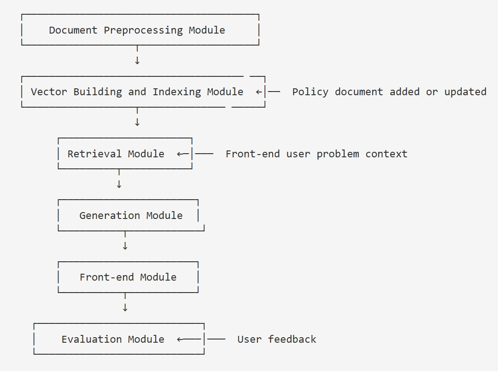
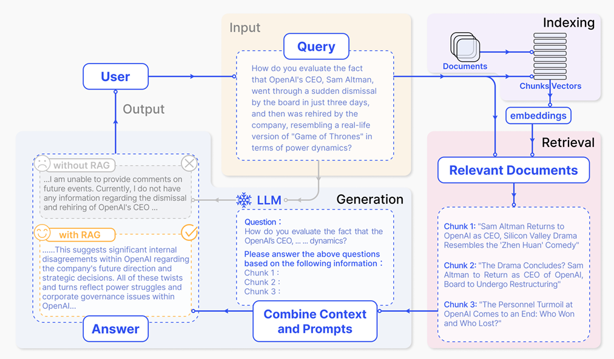

# RAGnition

LU Graduation Project RAGnition Team

# CDS536 Data Science Project

Group Name:            RAGnition

Director:              Prof. LI

Project:        Developing a Policy QA System Using Retrieval-Augmented Generation (RAG) Framework

| English Name | Email Address (Lingnan Email) |
|--------------|-------------------------------|
| LUO Suhai    | suhailuo@ln.hk                |
| WEI Fansen   | fansenwei@ln.hk               |
| LI Junrong   | junrongli@ln.hk               |
| WANG Jiawei  | jiaweiwang2@ln.hk             |
| Wang Zihao   | zihaowang3@ln.hk              |
| GUAN Yuqi    | yuqiguan@ln.hk                |

# RAGnition

Policies are often complex, lengthy, and filled with technical language, making it challenging for individuals to
extract the specific information they need efficiently. A policy QA System aims to bridge this gap by providing concise,
accurate, and user-friendly answers to policy-related queries. Traditional QA systems typically have pre-defined QA
pairs and then use information retrieval techniques to find QA pairs related to users’ questions. As LLM becomes
popular, a machine can generate answers without retrieving information. However, generation-based systems often face a
significant challenge –hallucinations, where the system generates incorrect or fabricated information that lacks
grounding in factual data, which is a critical problem for a policy QA system.

This project addresses the hallucination problem by developing a QA system based on the Retrieval-Augmented Generation (
RAG) framework. RAG combines the best of retrieval-based and generation-based approaches, aiming to significantly reduce
hallucinations in language model outputs by grounding answers in factual, retrieved data. The RAG framework operates
through two main components: the retrieved part and the generation part. The retrieval part retrieves relevant policy
documents or sections from policy documents on user queries. The generation part synthesizes an easy-to-understand
response based on the retrieved content. Unlike standalone generative models that may invent fake details when faced
with incomplete information, the RAG approach ensures that all answers are firmly rooted in the retrieved policy data.
This enhances the credibility and reliability of the system.An additional challenge in building such a system is
balancing speed and accuracy. While users often expect rapid responses, the system must also ensure that answers are
precise and factually grounded. Students will explore various techniques to optimize this trade-off, ensuring that the
QA system is both efficient and accurate for real-time policy inquiries.

# Reference

1. Lewis, P., Perez, E., Piktus, A., Petroni, F., Karpukhin, V., Goyal, N., ... & Kiela, D. (2020). Retrieval-augmented
   generation for knowledge-intensive nlp tasks. Advances in Neural Information Processing Systems, 33, 9459-9474.
2. Gao, Y., Xiong, Y., Gao, X., Jia, K., Pan, J., Bi, Y., ... & Wang, H. (2023). Retrieval-augmented generation for
   large language models: A survey. arXiv preprint arXiv:2312.10997.
3. Wu, J., Zhu, J., Qi, Y., Chen, J., Xu, M., Menolascina, F., & Grau, V. (2024). Medical Graph RAG: Towards safe
   medical large language model via graph retrieval-augmented generation. arXiv preprint arXiv:2408.04187.
4. https://www.cnblogs.com/tgltt/p/18512586
5. https://mp.weixin.qq.com/s/qfw44Yu9b9hHXu7hOURwJw
6. https://mp.weixin.qq.com/s/G0Zr_rOZARdMkY4Cuh1opA
7. https://mp.weixin.qq.com/s/Kxoho142yXTiW4jdZntVlQ
8. https://mp.weixin.qq.com/s/3_a97BTspZuZpFQNLt50gA
9. https://mp.weixin.qq.com/s/NzcWykZ46oOFKRjalTuKIA
10. https://mp.weixin.qq.com/s/NzcWykZ46oOFKRjalTuKIA
11. https://mp.weixin.qq.com/s/dmiwvA8Rtl6MR4EVHS88Eg
12. https://mp.weixin.qq.com/s/qPiPeWLIzlIbQlb2ZdAVcg
13. https://mp.weixin.qq.com/s/BmJMVgxj7YwmTj6X3Dkd6Q
14. https://mp.weixin.qq.com/s/g7mbN5Uh-w6jyxQC61-DRQ

# System Architecture

# RAGnition Talk Series

### RAGnition Talk 1

| Time   | 周二 2025-01-14 14:00 - 16:00          |
|--------|--------------------------------------|
| Period | 0101-0112                            |
| Output | Literacy Review in everyone's folder |

### RAGnition Talk 2

| Time   | 周五 2025-01-17 13:00 - 15:00 |
|--------|-----------------------------|
| Period | 0113-0119                   |
| Output | Roadmap                     |

### Chinese New Year Festival

| Time   | -         |
|--------|-----------|
| Period | 0120-0131 |
| Output | Rest      |

### RAGnition Talk 3

| Time   | 周一 2025-02-10 10:00 - 12:00                                     |
|--------|-----------------------------------------------------------------|
| Period | 0201-0209                                                       |
| Output | Current Model Effects & Division of labour in everyone's folder |

### RAGnition Talk 4

| Time   | 周五 2025-02-21 13:00 - 15:00                            |
|--------|--------------------------------------------------------|
| Period | 0210-0216                                              |
| Output | We ask some questions and get answers from instructors |

### RAGnition Talk 5

| Time   | 周二 2025-03-04 13:00 - 15:00   |
|--------|-------------------------------|
| Period | 0217-0302                     |
| Output | Report the first stage effort |

### RAGnition Talk 6

| Time   | 周五 2025-03-14 13:00 - 15:00     |
|--------|---------------------------------|
| Period | 0303-0316                       |
| Output | complete version one rag system |

### RAGnition Talk 7

| Time   | 周二 2025-04-01 13:30 - 15:00                  |
|--------|----------------------------------------------|
| Period | 0317-0330                                    |
| Output | add stream answer output,use qdrant database |

[//]: # (![rehearsal.jpg]&#40;figuras/rehearsal.jpg&#41;)

### RAGnition Rehearsal

| Time   | 周三 2025-05-07 14:00 - 18:00                                                                                                                                                                                                                                                              |
|--------|------------------------------------------------------------------------------------------------------------------------------------------------------------------------------------------------------------------------------------------------------------------------------------------|
| Period | 0331-0430                                                                                                                                                                                                                                                                                |
| Output | 1. Avoid plosives (popping sounds) by mastering microphone technique. 2. Speak without heavy reliance on notes—minimize reading verbatim. 3. Engage the audience: Blend Q&A, polls, or rhetorical questions. 4. Deliver fluent English—practice to eliminate pauses/fillers. |

### RAGnition Presentation

| Time   | 周四 2025-05-08 11:30 - 12:00 |
|--------|-----------------------------|
| Period | 0501-0508                   |
| Output | Well Done !                 |

[//]: # (![presentation.jpg]&#40;figuras/presentation.jpg&#41;)

### HongKong AI+ Power 2025 PoliSage Exhibition

| Time   | 周四 2025-06-05 到 周五 2025-06-06                                                                             |
|--------|-----------------------------------------------------------------------------------------------------------|
| Period | 0509-0606                                                                                                 |
| Output | 1. Designing promotional posters. 2. Pitching to investors. 3. Representing LU at the exhibition. |

| Time   | To Be Done |
|--------|------------|
| Period | 0509-0603  |
| Output | To Be Done |

# Obstacles

1. 政策的实时性？
   网页上的政策是实时的。

2. 文档分割算法效果和时间
3. 向量数据库 QDRANT

4. 问题意图识别和关键词提取和时间
   建立同义词库，关键词库。

5. 参考文献的相似度和时间
6. 参考文献的相似度隐藏
7. 参考文档的关联度的排序。

8. 大模型的调用的稳定性和时间
   修改调用的方式，流失调用。不同的模型。首个token调用就快。答案里面没有换行符。前端对于回答答案的渲染。
   同一个问题的不同问法的回答。
   处理问题与政策无关的时候的参考文献。

部署到服务器，录视频，ppt，report，参加比赛。
遇到了哪些问题和响应的解决方法

future direction
网络部署的时候的流式传输
用户输入多语言

9. 多个文档表达相同意思
10. 文档时序，过期政策更新
11. 排序算法的显示数量
12. 检索结果质量完全依赖于初始向量相似度计算。
13. 缺乏上下文理解与自适应调整检索能力。
14. 无法处理多步推理与复杂查询需求。

解决方案，混合检索策略，稠密向量检索和关键词检索，稀疏向量检索，BM25。对检索结果进行二次排序，提升最相关内容的排名。
初次检索使用多查询检索，增加备选向量范围。jina ai的reranker和GPT-4o-mini LLM reranking哪一个更好。

15. 非文字知识库如何搭建
16. 复杂文件的识别，比如PPT、PDF、Word、HTML
当前是自定义的文档转化和文字识别，可以使用封装的docling
17. 当前模型的提示词是固定的，能否像ORM拼接SQL一样动态拼接提示词。针对不同的问题拼接不同的提示词？询问具体数字，询问人名地名，询问普通问题。
18. 传统的RAG是线性模式，输入-检索-生成。对于多轮问答或者复杂问题能否重构模型设计？输入-问题拆分-分别检索，综合回答。

19. 重构之后的设计提高的复杂问题的回答质量，但是面对简单复杂混合问题的场景，降低了响应时间，如果错误的拆解了简单问题反而会导致回答质量降低。
20. 如果是重构RAG范式呢？ReAG，推理增强检索，首先按照传统RAG的方式回答问题，如果检索文档不足以支撑答案，再拆解问题重新迭代。
21. 推理检索的确提高了精度，但是显著降低了检索生成效率。在学校场景中，问答助手应该重点关注简单问题的回答质量，因为高频问题重点关注，复杂问题无法回答是符合期待的，复杂问题应该书面或者当面询问教务处。
问答助手的设计理念是减少简单高频问题的侵扰。
20. hard prompt one shot 已经实现。
21. 实际搭建问答系统的过程中发现，政策文件数量越少，信噪比越高，回答越准确。政策文件的数量越多，信噪比越低，回答越不准。
22. 除了重排，还应该加上元数据，区分问题中指代对象。例如，Windows系统安装流程，回答可能同时检索到Linux系统和Windows系统的安装流程。
我们当前是使用数据库隔离的方法把每个学院单独分离开。如果融合到一起，可以在每个文档源加上元数据标注。
23. 文档分割除了按照段落分割之外能不能用llm分割，分割准确但是可能丢失内容与源文档不严格一致。
24. 从零开始构建知识库和RAG用什么方案？Outline+Qdrant。纯文字的检索精确率高，对于多模态不能很好的适应。
单独增加一个图表向量入库的步骤。
25. 如果是同源同构的知识库，怎么做到精准定位参考文献的原文位置。
需要在向量编码的时候，把原文段落、向量、网页链接、权限、等等元数据合并计入数据库。展示答案的时候提供拼接后的网页链接，直接跳转到知识库对应章节。
26. 为什么要做RAG？私域数据不在大模型的训练范围，大模型参数记忆截止某个时间点，大模型回答产生幻觉。
